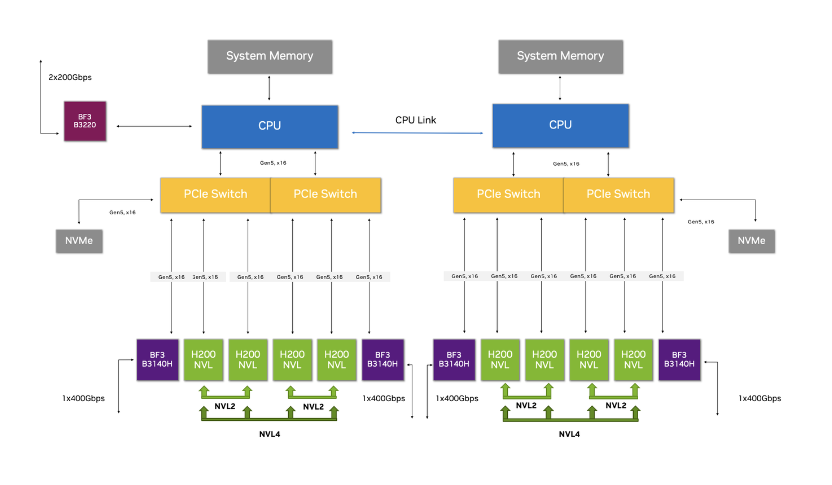
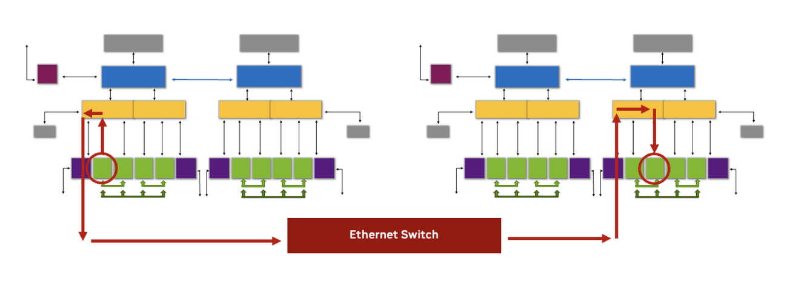
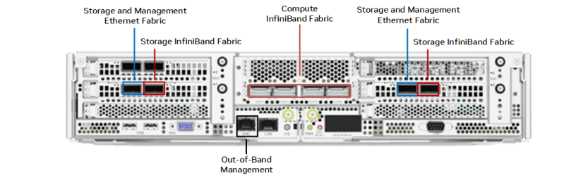
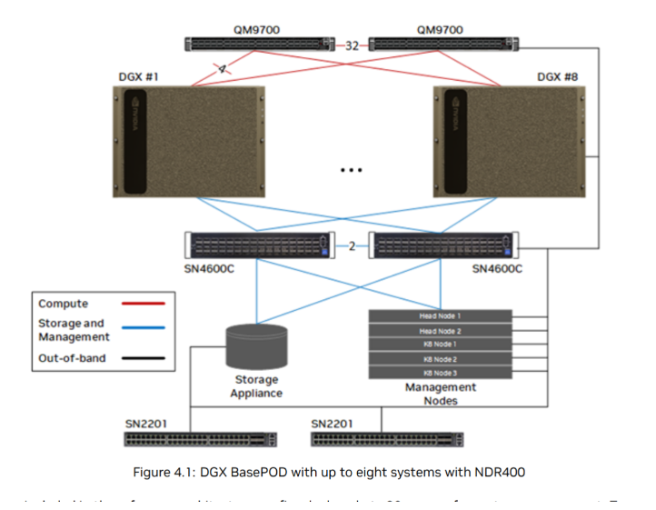
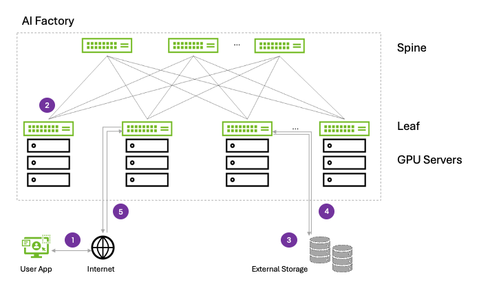

# 01 · Infrastructure

The compute layer. LLMs generally require **AI-specific hardware (GPUs)**.
What infrastructure you have — and how you deploy it — drives cost, speed, and
what model sizes you can run at all.

## Three deployment modes

| Dir | Mode | When to use |
|-----|------|-------------|
| `on-premise/` | Own the hardware | You have the budget/resources and want full control. |
| `cloud/` | Rent capacity | Scale up/down on demand; no upfront hardware. |
| `local/` | Laptop / dev box | Small models, prototyping. Limited by local GPU. |

---

# Reference architecture: NVIDIA DGX BasePOD

A concrete example of the on-premise mode: NVIDIA's
[DGX BasePOD reference architecture](https://docs.nvidia.com/dgx-basepod/reference-architecture-infrastructure-foundation-enterprise-ai/latest/).
We zoom out in five steps — **chip → node → inter-node → rear I/O → POD →
datacenter fabric** — since every layer above inherits the bandwidth and failure
domains set here.

> **Glossary:** **H200 NVL** = the GPU · **NVLink (NVL2/NVL4)** = fast GPU↔GPU bus
> inside a node · **BlueField-3 (BF3)** = NIC/DPU between nodes · **PCIe Gen5 x16**
> = CPU↔device bus · **InfiniBand (QM9700)** = compute network · **Spectrum
> Ethernet (SN4600C / SN2201)** = storage / management / out-of-band networks.

## 1 · Inside one node



A single node is a **dual-socket server**: two CPUs (each with its own system
memory) joined by a **CPU link**, and eight **H200 NVL** GPUs split four-per-CPU.

| Component | Role | Link |
|-----------|------|------|
| **CPU ×2** | Host: scheduling, data loading, the OS. Joined by a **CPU link** so either socket can reach the other's memory. | — |
| **System memory** | Host RAM per socket. | — |
| **PCIe switch ×2 per CPU** | Fan a single CPU's lanes out to many GPUs/NICs/NVMe. | Gen5 x16 |
| **H200 NVL ×8** | The GPUs — where the model actually runs. | — |
| **NVMe** | Local fast storage (datasets, checkpoints, scratch). | Gen5 x16 |
| **BF3 B3140H ×4** | BlueField-3 DPUs — the **compute-fabric** NICs, 1×400Gbps each. | — |
| **BF3 B3220** | BlueField-3 for **storage/management**, 2×200Gbps. | — |

**The bandwidth hierarchy is the whole point.** Two GPUs talk at very different
speeds depending on how far apart they are:

```
NVL2  ── a pair of GPUs           ┐
NVL4  ── a group of four GPUs     ├─ NVLink: fastest, stays inside the node
within-node, over PCIe switch     ┘
across nodes, over BF3 + network  ── slowest (next section)
```

> **Why it matters:** training splits one model across many GPUs. Keep the
> chattiest traffic on **NVLink** (NVL2/NVL4) and you go fast; spill it across
> the slower hops and the GPUs sit idle waiting on data. How a model is sharded
> (layer 2) is constrained by exactly this picture.

## 2 · GPU-to-GPU across two nodes



When the model is bigger than one node's 8 GPUs, GPUs in *different* nodes must
exchange gradients/activations. The red path traces that hop:

```
GPU (node A) → PCIe switch → BF3 NIC → network switch → BF3 NIC → PCIe switch → GPU (node B)
```

This is the **slowest tier** of the hierarchy from step 1 — it leaves the node.
The **BlueField-3 DPU** does this with **RDMA** (the NIC reads/writes GPU memory
directly, bypassing the CPU), so the host isn't a bottleneck. The dedicated
**compute fabric** (InfiniBand, next sections) exists precisely so this
cross-node hop stays as fast as physically possible.

> **Why it matters:** the gap between "two GPUs on the same NVLink" and "two GPUs
> in different racks" can be 10×+. Scaling out adds GPUs but also adds slow hops —
> which is why network design (steps 4–5) is a first-class part of compute, not
> an afterthought.

## 3 · The back of a server (rear I/O)



Flip a node around and the abstract "links" become physical cabling. A BasePOD
node carries **four separate networks**, each on its own ports:

| Fabric | Purpose | Tech |
|--------|---------|------|
| **Compute InfiniBand** | GPU↔GPU across nodes (step 2). Highest bandwidth. | InfiniBand (NDR) |
| **Storage InfiniBand** | High-throughput reads/writes to the storage appliance. | InfiniBand |
| **Storage & Management Ethernet** | In-band management, provisioning, slower storage. | Ethernet |
| **Out-of-Band (OOB) Management** | Lights-out control (BMC/IPMI) — power-cycle and recover a node even when the OS is down. | Ethernet |

> **Why it matters:** these are kept physically separate on purpose — a storm of
> storage traffic must never steal bandwidth from the compute fabric, and OOB has
> to work when everything else is broken. "It's all just networking" is how you
> get a cluster that's mysteriously slow under load.

## 4 · The physical POD — up to eight systems



One node rarely ships alone. The **BasePOD** is the repeatable building block:
**up to eight DGX systems** plus the switching, storage, and control plane that
turn them into one cluster.

| Element | Count | Role |
|---------|-------|------|
| **DGX #1 … #8** | up to 8 | The GPU compute nodes from steps 1–3. |
| **QM9700** | 2 | InfiniBand spine switches — the **compute fabric** (NDR400). |
| **SN4600C** | 2 | Spectrum Ethernet — storage & management fabric. |
| **SN2201** | 2 | Ethernet — **out-of-band** management network. |
| **Storage appliance** | 1 | Shared high-performance dataset/checkpoint storage. |
| **Management nodes** | 5 | **Head Node ×2** (cluster control, redundant) + **K8s Node ×3** (Kubernetes control plane). |

The legend's colour coding maps straight back to step 3's four fabrics:
**compute (red)**, **storage & management (blue)**, **out-of-band (black)** —
each node's rear ports, now drawn as cluster-wide networks.

> **Why it matters:** this is the unit you actually budget, rack, power, and cool.
> The **head nodes** and **K8s nodes** are why your orchestration layer (4) has
> something to schedule against — GPUs become a *pool* here, not eight separate
> boxes. Multiple PODs combine into a **SuperPOD** for larger clusters.

## 5 · The datacenter network — the "AI Factory"



Zoom out once more and the POD's switches become a **spine-leaf (fat-tree)**
fabric — the standard topology for AI datacenters because it gives any GPU server
a predictable, high-bandwidth path to any other.

| Tier | Role |
|------|------|
| **Spine** | Top-level switches; every leaf connects to every spine. |
| **Leaf** | Top-of-rack switches; each fans out to the GPU servers in its rack. |
| **GPU servers** | The DGX nodes from step 4. |

The numbered flows show how the cluster meets the outside world:

1. **User app** sends a request…
2. …in over the **internet** to a **leaf** switch,
3. routed up through the **spine** to the GPU servers that serve the model,
4. which read/write **external storage** as needed,
5. and return the result back out to the user.

> **Why it matters:** "non-blocking" spine-leaf means adding racks doesn't create
> bottlenecks between them — the fabric scales with the cluster. This is the layer
> that makes a roomful of GPUs behave like one machine, and it's the physical
> reality underneath the whole rest of this repo's stack.

## From this layer up

```
datacenter fabric (spine-leaf)        ← step 5
  └─ POD (8 nodes + switches + mgmt)   ← step 4
       └─ node (rear I/O, 4 fabrics)   ← step 3
            └─ inter-node GPU (BF3/RDMA)← step 2
                 └─ node internals      ← step 1  (NVLink, PCIe, 8× H200)
                      └─ the GPU
```

Everything above — which **models** (layer 2) you can fit, how fast **data**
(layer 3) feeds them, what your **orchestration** (layer 4) can schedule — is
bounded by the bandwidth and failure domains drawn on this page.

*Source: NVIDIA, "DGX BasePOD Reference Architecture — Infrastructure Foundation
for Enterprise AI." Diagrams in `img/` are from / adapted from that document for
teaching.*
- Capacity & cost notes per environment
