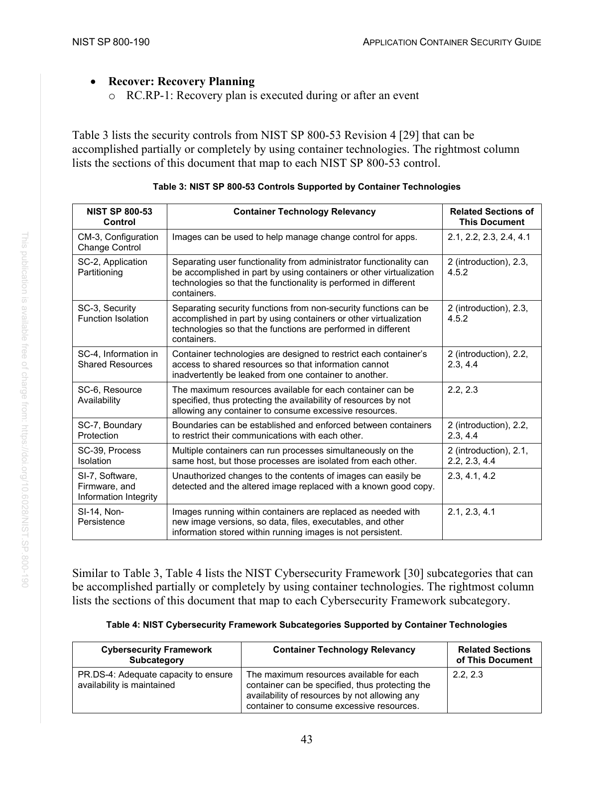
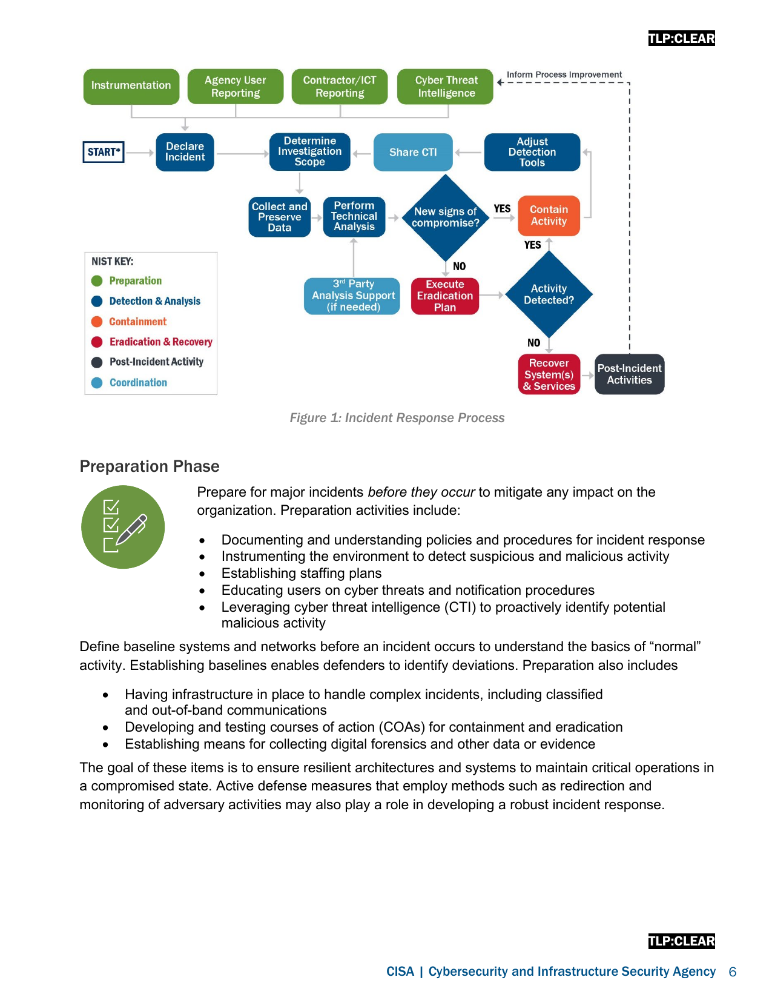
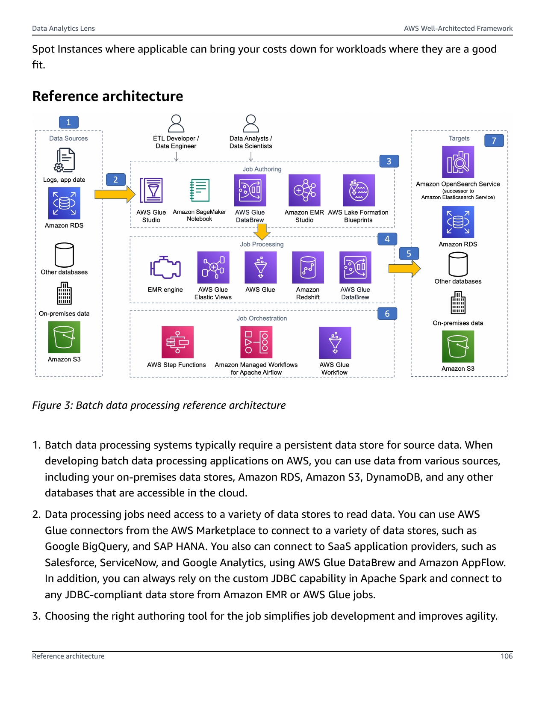
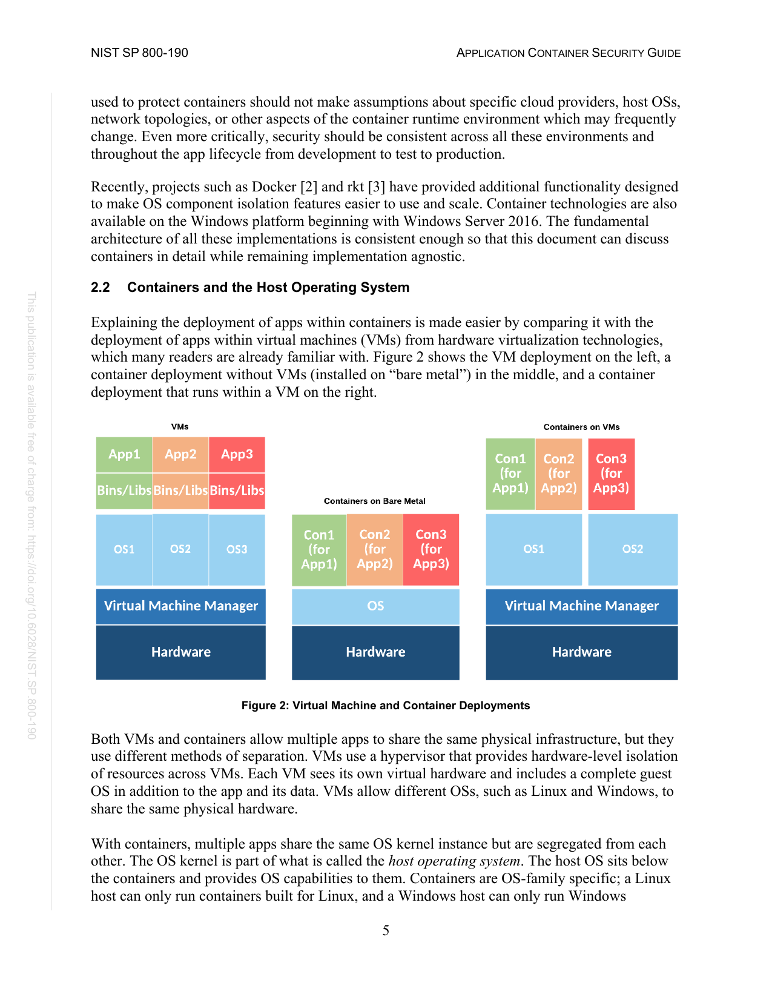

# 03 · Data

A base model is frozen at a **knowledge cutoff** and has never seen your private
data. This layer supplements it with extra, fresh, or private knowledge **at
answer time** — no retraining. The headline technique is **RAG**
(Retrieval-Augmented Generation): retrieve the relevant context, then put it in
the prompt.

The line from the Models layer holds: **RAG for knowledge, fine-tune for
behaviour** ([`02-models/`](../02-models/)). If the model has the skill but lacks
the facts, you are in the right place.

## How we got here · the evolution of retrieval

RAG didn't arrive fully formed. Search grew up one step at a time, and each step
fixed the blind spot of the one before. Walking that short history is the fastest
way to see *why* the pipeline below looks the way it does — every phase is an answer
to a limitation an earlier era hit.

**Era 1 · Keyword search.** The earliest engines answered one question: *where does
this word appear?* Documents were indexed with **inverted indices** (a map of
keyword → documents that contain it) and ranked with **TF-IDF** or **BM25** by how
important or frequent each term was. This still powers much of the web — but it
doesn't understand language. It matches *symbols*, not *meaning*, so synonyms and
intent are invisible:

```
   query "my pod keeps restarting"   ✗   doc "fixing CrashLoopBackOff"
   same problem, 0 shared words → keyword search never finds it
```

The burden was on the user to guess the exact right words.

**Era 2 · Semantic search.** The leap: represent text as **meaning** instead of
words. Each piece of text becomes a **vector** — a list of numbers — learned by a
neural network trained on massive text. Having seen words in context, the model
places similar concepts close together even when the words differ. *Espresso* lands
right next to *coffee*, and nowhere near *house*:

```
        ▲ y
        │   ● coffee     (0 1 0)
        │  ● espresso              near coffee in meaning
        │
        │               ● house    (1 0 0)
        └────────────────────────────▶ x
   position = meaning · distance = (dis)similarity
```

## Chapter 1 · The simple pipeline

Semantic search at scale *is* the RAG pipeline. The simplest version: embed docs
offline; per query, embed it, fetch top-k, then prompt.

```
BUILD (offline, once)                     ANSWER (per query)
  sources → clean → chunk → embed → ⛁     query → embed → retrieve top-k → prompt → model → answer
                                    └────────────────► ⛁ ◄──────────┘
```

Useful, but naïve: similarity-only, fixed top-k, trusts the user's phrasing — the gaps
Chapter 2 closes. Phases 1–6 below detail each piece; [Lab 1](#labs-run-on-a-free-kaggle-gpu)
builds it end-to-end.

## Phase 1 · Sources

The raw knowledge you want the model to use. It arrives in three broad shapes,
and the shape decides how much pipeline work you do before it is usable.

| Shape | Examples | Pipeline cost |
|-------|----------|---------------|
| **Unstructured** | PDFs, web pages, docs, email, chat logs, transcripts | High — parse, clean, chunk |
| **Semi-structured** | Markdown, HTML, JSON, CSV, tables | Medium — structure-aware splitting |
| **Structured** | SQL databases, APIs, spreadsheets | Low for the data; you often query it directly instead of embedding |

In reality data look messy:






---

## Phase 2 · Pipelines — clean & chunk

Raw sources are cleaned (strip boilerplate, headers/footers, navigation, repeated
legal text) and then **chunked** — split into passages small enough to embed and
to fit in the prompt, large enough to carry meaning.

Chunking is the highest-leverage, most-overlooked choice in the whole layer. Too
big and a chunk dilutes the signal and wastes context; too small and it loses the
surrounding meaning.

| Strategy | How | When |
|----------|-----|------|
| **Fixed-size** | N tokens with an overlap (e.g. 512 / 256) | default, simple, robust |
| **Recursive** | split on paragraphs → sentences → words until it fits | good for prose |
| **Structure-aware** | split on Markdown headings, code blocks, table rows | docs/code with clear structure |
| **Semantic** | split where the topic shifts (embedding-distance) | best quality, more compute |

Two knobs matter most:

- **Chunk size** — measured in *tokens*, not characters. A common range is
  256–1024; smaller favours precise retrieval, larger favours context.
- **Overlap** — repeat the last ~10–20% of one chunk at the start of the next so
  a sentence split across the boundary isn't lost.

Each chunk is stored with **metadata**: source id, title, page/section, timestamp,
and the ACL/tenant tag from Phase 1. Metadata is what lets you filter ("only this
customer's docs", "only since 2026") and cite the answer back to a source.

---

## Phase 3 · Embeddings

An **embedding** turns text into a **vector** (a list of numbers, e.g. 384–1536)
that encodes its *meaning* — similar meaning lands nearby, even with no shared words:

```
"how do I reset my password"   → [ 0.21, -0.07,  0.88, … ]
"forgot my login credentials"  → [ 0.19, -0.05,  0.85, … ]   ← nearly same direction
                cosine / dot(a, b) ≈ 0.97  →  near in meaning  →  retrieve
```

Retrieval is just *find the nearest vectors*. The embedder is its own small model,
separate from the LLM (CPU or a sliver of GPU).

| Choose on | Why it matters |
|-----------|----------------|
| **Dimensions** | bigger = more nuance but more storage + slower search (384 vs 1024 vs 1536) |
| **Max input length** | the chunk must fit the embedder's window, not just the LLM's |
| **Domain / language** | a model strong in your language/domain (e.g. Vietnamese, legal, code) wins |
| **Open vs API** | self-host (`bge`, `e5`, `gte`) keeps data private; API (OpenAI, Cohere, Voyage) is zero-ops |

Non-negotiable rule: **embed the documents and the queries with the same model.**
Two models produce incomparable vector spaces, and "near" becomes meaningless. If
you change the embedding model, you must re-embed the entire corpus.

---

## Phase 4 · Vector store

A database built to store millions of embeddings and answer *nearest-neighbour*
queries in milliseconds. A brute-force scan is exact but O(n); real stores use an
**ANN** (approximate nearest-neighbour) index that trades a sliver of recall for a
huge speed-up.

| Index | Idea | Trade-off |
|-------|------|-----------|
| **Flat** | compare against every vector | exact, but slow past ~100k |
| **HNSW** | a navigable graph of neighbours | fast + high recall; more memory (the common default) |
| **IVF** | cluster vectors, search nearest clusters | smaller memory; tune `nprobe` for recall |

| Store | Shape | Good for |
|-------|-------|----------|
| **FAISS** (lib) | in-process library | labs, prototypes, embedded use *(our labs)* |
| **Chroma** | lightweight local server | small apps, quick start |
| **pgvector** | Postgres extension | already on Postgres; SQL + vectors together |
| **Qdrant / Weaviate / Milvus** | dedicated vector DB | production scale, metadata filtering, hybrid search |

The **similarity metric** must match how the embedding model was trained — usually
**cosine** (angle) or **dot product**; some use **L2** (Euclidean). And a good
store filters on metadata *during* the search (e.g. `tenant = X AND date > Y`), so
permissions and freshness are enforced at retrieval, not after.

---

## Phase 5 · Retrieval

Answer time. The query is embedded with the **same model**, the store returns the
**top-k** nearest chunks, and those — and only those — become the model's context.

- **top-k** — how many chunks to fetch (often 3–10). Too few starves the model;
  too many adds noise and burns context budget.

```
query → embed → vector top-k → prompt
```

---

## Phase 6 · RAG — putting it together

Retrieval-Augmented Generation stitches the retrieved chunks into the prompt so
the model answers *from them*, with a citation back to the source:

```
SYSTEM: Answer only from the context. If it isn't there, say you don't know.
CONTEXT: <chunk 1> <chunk 2> … <chunk k>
USER: <the question>
```

This is the **open-book exam** vs memorizing: the model looks things up at answer
time instead of recalling from training. The payoffs are fresh + private knowledge
without retraining, **citations** (answers grounded in named sources), and a cheap
way to update knowledge — re-index, don't re-train. (Going further — hybrid search,
reranking, query rewriting, agentic RAG — is Chapter 2.)

---

## Phase 7 · Evaluation

"The demo answered well" is not evidence — the same trap as the Models layer. RAG
has **two** things to measure, because it has two stages that can each fail:

| Stage | Question | Metrics |
|-------|----------|---------|
| **Retrieval** | did we fetch the right chunks? | recall@k, precision@k, MRR, hit-rate |
| **Generation** | did the answer use them faithfully? | faithfulness (no hallucination), answer relevance, correctness |

The killer failure mode is **hallucination** — a fluent answer not supported by
the retrieved context. **Faithfulness** measures exactly that: is every claim in
the answer grounded in a chunk? Frameworks like **RAGAS** score faithfulness,
answer relevance, and context recall/precision, often using an LLM-as-judge.

Diagnose failures by stage:

- Wrong/empty answer but the right chunk *was* retrieved → a **generation**
  problem (prompt, model, or context too noisy).
- Right answer impossible because the chunk *wasn't* retrieved → a **retrieval**
  problem (chunking, embedding, top-k, or you need a reranker).

Knobs to sweep against a held-out question set: chunk size, overlap, top-k,
hybrid on/off, reranker on/off, embedding model. Report quality **with** latency
and cost — never a single number.

---

## Chapter 2 · RAG in production

### The advanced pipeline


Measure first (Phase 7), then pull the levers. Chapter 1 works, but it's naïve.
Four levers make retrieval *good* — each closes a gap it left open:

```
ANSWER (advanced)
  query → rewrite / expand intent
        → hybrid: vector ∪ BM25  ──filter by tag──► ⛁ → top-30
        → rerank (cross-encoder) → top-5 → prompt → model → answer + citation
```

- **Hybrid search** — dense vectors nail meaning but miss exact terms (error codes,
  flags, rare names); fuse them with keyword **BM25** to get both.
- **Reranking** — over-fetch a cheap top-30, then a **cross-encoder** rescores
  query+chunk *together* and keeps the best 3–5. Biggest lever after chunking.
- **Query understanding** — don't trust the user's phrasing: **rewrite/expand** it,
  **multi-query** (union several rephrasings), or **HyDE** (embed a drafted answer).
- **Metadata filtering** — the `source · ACL · date` tags from Phase 2 restrict the
  search (this tenant, since 2026) and enforce permissions.

[Lab 2](#labs-run-on-a-free-kaggle-gpu) runs all of this over the real k8s docs and
measures the levers on an independent eval set.

---

### Frameworks · LangChain in one minute

**LangChain** is a general framework for LLM apps — agents, chatbots, workflows — of
which RAG is the most common. It adds **no new concept** to this layer: it
*productizes the seven phases*, turning each into one pre-built, swappable component.
(LlamaIndex and Haystack are the main alternatives.)

| Phase | By hand (Chapters 1–2) | LangChain |
|-------|------------------------|-----------|
| 1 · Sources | `{id, text, meta}` dicts | `Document(page_content, metadata)` |
| 2 · Chunk | hand-written splitter | `RecursiveCharacterTextSplitter` |
| 3 · Embeddings | `SentenceTransformer.encode` | `HuggingFaceEmbeddings` |
| 4 · Vector store | `faiss.IndexFlatIP` + `.add` | `FAISS.from_documents` |
| 5 · Retrieval | hand-written `retrieve(q, k)` | `store.as_retriever(k=…)` |
| 6 · RAG prompt | manual chat template + `.generate` | `ChatPromptTemplate \| chat` (LCEL) |

Two things stay true whatever the framework. It's **client-side orchestration** — the
chain runs *in your process* and calls model/DB endpoints; there's no "submit a job to
their cloud" (running on managed infra is a *deploy* step, not the chain). And
**evaluation lives outside the chain** — a framework writes the pipeline; it doesn't
measure or operate it.

Learn the phases by hand and LangChain is just learning which method wraps each one —
proven in [`labs/lab1-langchain/`](labs/lab1-langchain/): Lab 1 rebuilt
component-for-component, same numbers out.

### RAG vs long context — why not just stuff the window?

With the pipeline built and productized, the honest question: why retrieve at all,
rather than dump everything into a long context window?

| Dimension | Long context — stuff the window | RAG — retrieve first |
|-----------|---------------------------------|----------------------|
| **Infrastructure** | the "no-stack stack" — no DB, embedder, reranker, or sync to keep | heavy: chunking + embedder + vector DB + reranker + keeping vectors in sync |
| **Retrieval reliability** | no retrieval step — the model sees everything | semantic search is probabilistic → **silent failure**: the answer was there, retrieval just didn't return it |
| **Cross-doc / global reasoning** | sees full documents → can spot what's *missing* (e.g. "which requirements were omitted from the release?") | only isolated snippets → can't reason over the *gap between* documents |
| **Cost per query** | reprocesses every token on **every** call (a 500-pg manual ≈ 250k tokens each time) | pays the processing cost **once at index time**; fetches a few chunks per query |
| **Accuracy at scale** | attention dilutes — a needle buried in a huge context is missed or hallucinated | top-k (say 5 chunks) removes the haystack → the model focuses on signal |
| **Data ceiling** | ~1M tokens is a drop against enterprise data lakes (TB–PB) | a retrieval layer filters an effectively infinite corpus down to what fits |

The decision rule that falls out:

- **Bounded data + global reasoning** — one legal contract, a single book to
  summarize → **long context** wins (simpler stack, sees the whole picture).
- **Fresh, private, or effectively infinite knowledge** — an enterprise corpus →
  **RAG** remains the only viable warehouse.

Caveat on the cost line: **prompt caching** offsets long context for *static* data,
but a *dynamic* corpus pays the full token tax on every request.

### The platform

The bigger shift is operational. You stop maintaining *N notebooks* and start running
**one platform that many RAG apps plug into**. The app code (LangChain/LlamaIndex)
becomes the thin, per-app part; the platform — everything around it — is the real job.
The seven phases stop being code each team rewrites and become **shared services +
per-app config**:

```
        ┌──────────────────  PLATFORM (you own)  ──────────────────┐
        │  Embedding svc   Vector store     Model gateway          │
        │  (versioned)     (multi-tenant)   (LLM+reranker, quota)  │
        │  Ingestion orchestrator   Eval harness   Observability   │
        │  Secrets / IAM / ACL      Cost metering                  │
        └───────────▲──────────────────────────────▲───────────────┘
                    │ plug in via config           │
   app-A (HR docs)      app-B (support KB)      app-C (legal) …
   corpus + chunk params + top-k + prompt + model  ← each team sets
```

- **Per-app = config, not infra** — corpus, chunk size/overlap, top-k, hybrid on/off,
  prompt, model. A few lines a team owns.
- **Platform = shared services** — one *versioned* embedder (swap it ⇒ re-embed every
  corpus), one multi-tenant vector store (a namespace + ACL per app), one model gateway
  (quota + cost per app), orchestrated ingestion, and an **eval gate in CI** (a change
  that drops hit@k / faithfulness fails the build, like a red test).

The day-2 concerns scale with the fleet, each attributed per app:

- **Freshness** — *how to stop chunks going stale?* Re-index on change or nightly; a stale chunk answers confidently wrong.
- **Cost** — *how to keep spend in check?* Embeddings + storage + retrieval + the extra prompt tokens RAG adds.
- **Governance** — *how to enforce PII/ACL and right-to-delete?* ACL *at retrieval*; on delete the vectors must go too — a copy left behind is still a leak.
- **Silent retrieval failures** — *how to catch an answer that was there but never retrieved?* Only monitoring + continuous eval do.

**One-liner:** *you don't write RAG, you operate a platform; each app is config on
top.* That is **data-ops at fleet scale** — the job the ops/deploy layer builds.

---

## Labs (run on a free Kaggle GPU)

Two self-contained Kaggle notebooks (~25 min each), one per chapter, reproducible by
any student on the same **T4 (16 GB)** and **Qwen2.5-3B-Instruct** as the Models labs,
so the layers chain. Setup is in [`labs/README.md`](labs/README.md).

| Lab | Chapter | What you'll do | Time |
|-----|---------|----------------|------|
| **1 · Simple RAG, made visible** | Chapter 1 | over a real public k8s Q&A dataset ([`kubernetes_qa_pairs`](https://huggingface.co/datasets/ItshMoh/kubernetes_qa_pairs)): **print the exact chunks** a query loads, watch **top-k** grow, compare **chunk sizes**, then feed the top chunks to Qwen2.5-3B for a **grounded, cited** answer (and a *"I don't know"* refusal) | ~25 min |
| **2 · Advanced RAG over real k8s docs** | Chapter 2 | clean + **128-token chunk** the real [`kubernetes/website`](https://github.com/kubernetes/website) docs (~9k chunks), add **metadata filtering**, **hybrid (BM25)**, and a **reranker**, then **measure** them on an **independent** eval set (40 hand-written Qs → gold doc; **hit@3** / **MRR**) | ~12 min |

Lab 1 centers on **retrieval** on a tidy Q&A set; Lab 2 takes the pipeline to the
**real docs** — messy markdown, real chunking, and an honest eval (questions mapped to
gold docs, not to the chunks themselves). Constraints like the Models labs: free GPU
(pick **T4**), fp16 LLM, embedder + reranker on CPU, Internet **On** (Lab 2 also clones
the docs). The CPU core runs on any GPU; only the grounded LLM answer needs the T4.

---
