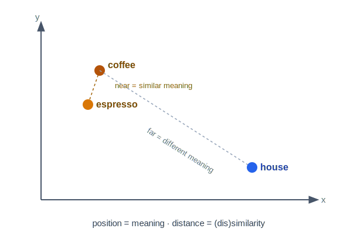
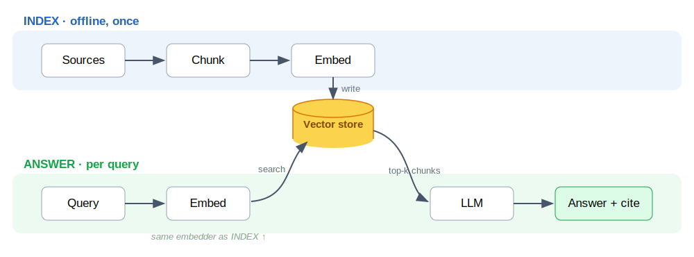
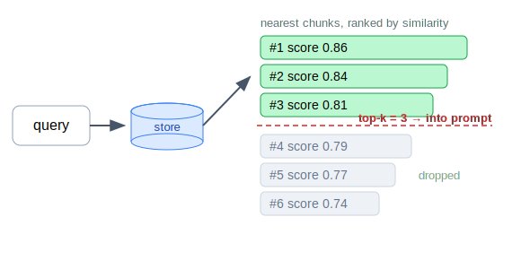
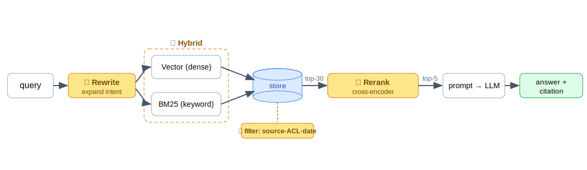
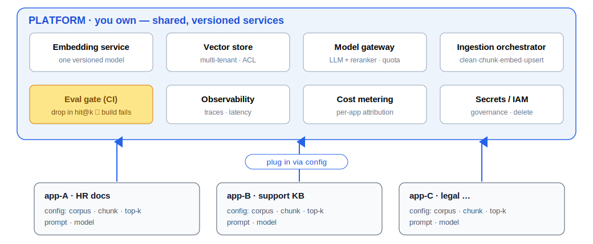

<!-- _class: lead -->
<!-- _paginate: false -->

# Data — deep dive

<!--
The Data layer (Layer 3). Maps 1:1 to 03-data/README.md. Labs run on the same free
Kaggle T4 (16 GB) + Qwen2.5-3B as the Models layer, so the layers chain. Pace: a few
slides of concept per phase, then the notebook.
-->

---

## Why this layer

A base model is **frozen at its knowledge cutoff** and has never seen your private
data. This layer supplements it with fresh / private knowledge **at answer time —
no retraining.** The headline technique is **RAG** (Retrieval-Augmented Generation).

- Need new **knowledge**? → **RAG** (this layer)
- Need new **behaviour**? → **fine-tune** (`02-models/`)

The line that holds the course together: **RAG for knowledge, fine-tune for
behaviour.** They stack — fine-tune the tone, retrieve the facts.

<!--
The one rule students forget. If the model has the skill but lacks the facts, you are
in the right place. RAG = open-book exam; fine-tune = what it memorised.
-->

---

## How we got here · the evolution of retrieval

<style scoped>img { display:block; margin:6px auto 0; }</style>

**Era 1 · Keyword** — matches *words*, not meaning. A query for *"my pod keeps
restarting"* never finds the doc *"fixing CrashLoopBackOff"* — zero shared words.

**Era 2 · Semantic** — turn text into a **vector**, so *meaning becomes position*:
similar ideas land nearby even with no shared words.



<!--
Each era fixed the blind spot of the one before. Keyword still powers the web, but the
burden was on the user to guess the exact words. The plot is the whole idea of embeddings:
coffee/espresso cluster, house is far — distance = (dis)similarity. Semantic search at
scale IS the RAG pipeline (next).
-->

---

## RAG vs long context — why not just stuff the window?

| Dimension | Long context | RAG |
|-----------|--------------|-----|
| **Infrastructure** | none — "no-stack stack" | heavy: chunk + embed + vector DB + sync |
| **Reliability** | model sees everything | probabilistic → **silent failure** |
| **Cost / query** | reprocesses every token, every call | pays once at index time |
| **Data ceiling** | ~1M tokens | effectively infinite corpus |

- **Bounded data + global reasoning** (one contract, one book) → **long context**.
- **Fresh / private / huge** (an enterprise corpus) → **RAG**.

<!--
Why retrieve at all, rather than dump everything in the window? This motivates the pipeline
that follows. Not either/or — prompt caching offsets long context for *static* data, but a
*dynamic* corpus pays the full token tax every request. Long context can reason over the
*gap between* documents; RAG only sees isolated snippets.
-->

---

## The simple pipeline



**Index once, offline.** Per query: embed → fetch **top-k** → prompt → answer.
Naïve on purpose (similarity-only, fixed top-k) — the **advanced pipeline** closes the gaps; **Lab 1** builds it.

<!--
The whole layer on one slide. One shared vector store: INDEX writes it once; ANSWER reads
top-k from it per query. Note the same embedder feeds both sides — the #1 RAG rule. Walk
left-to-right on each lane.
-->

---

## Phase 1 · Sources

The raw knowledge. Its **shape** decides how much pipeline work before it's usable.

| Shape | Examples | Pipeline cost |
|-------|----------|---------------|
| **Unstructured** | PDFs, web, email, transcripts | High — parse, clean, chunk |
| **Semi-structured** | Markdown, HTML, JSON, CSV | Medium — structure-aware split |
| **Structured** | SQL, APIs, spreadsheets | Low — often query directly |

 

<!--
Real data is messy — tables, flowcharts, scanned PDFs. The "garbage in" point: most
RAG quality is won or lost before a single vector is computed.
-->

---

## Phase 2 · clean & chunk

Clean (strip boilerplate), then **chunk** — passages small enough to embed, large
enough to carry meaning. **The highest-leverage, most-overlooked choice in the layer.**

| Strategy | When |
|----------|------|
| **Fixed-size** (N tokens + overlap) | default, robust |
| **Recursive** (paragraph→sentence→word) | prose |
| **Structure-aware** (headings, code, rows) | docs / code |
| **Semantic** (split where topic shifts) | best quality, more compute |

Two knobs: **chunk size** (tokens, 256–1024) and **overlap** (~10–20%). Store each
chunk with **metadata** (source · page · date · ACL) → filter + cite.

<!--
Too big dilutes signal + wastes context; too small loses surrounding meaning. Metadata
is what later powers tenant filtering and citations. Lab 2 chunks the real k8s docs.
-->

---

## Phase 3 · Embeddings

Text → **vector** that encodes *meaning* — near in meaning, near in space:

```
"how do I reset my password"   → [ 0.21, -0.07, 0.88, … ]
"forgot my login credentials"  → [ 0.19, -0.05, 0.85, … ]
                cosine ≈ 0.97  →  near in meaning  →  retrieve
```

Choose on **dimensions** · **max input length** · **domain/language** · **open vs API**.

> **Non-negotiable rule:** embed documents *and* queries with the **same model**.
> Change the model ⇒ re-embed the entire corpus.

<!--
The embedder is its own small model, separate from the LLM (CPU or a sliver of GPU).
Two models = incomparable spaces, "near" becomes meaningless. Our labs use bge-small.
-->

---

## Phase 4 · Vector store

A DB for millions of embeddings, answering *nearest-neighbour* in ms. Real stores use
an **ANN** index — trade a sliver of recall for a huge speed-up.

| Index | Idea | Trade-off |
|-------|------|-----------|
| **Flat** | compare against every vector | exact, slow past ~100k |
| **HNSW** | navigable neighbour graph | fast + high recall; more memory *(default)* |
| **IVF** | cluster, search nearest clusters | smaller memory; tune `nprobe` |

**FAISS** *(our labs)* · Chroma · pgvector · Qdrant/Weaviate/Milvus (production scale).
Metric must match the embedder (**cosine**/dot). Filter metadata **during** search.

<!--
Filtering during search (tenant = X AND date > Y) enforces permissions + freshness at
retrieval, not after. FAISS flat is exact and plenty at lab scale.
-->

---

## Phase 5 · Retrieval

<style scoped>img { display:block; margin:2px auto 0; }</style>

At answer time the query is embedded with the **same model**; the store returns the
**top-k** nearest chunks — and *only* those become the context.



**top-k** (3–10): too few starves the model; too many buries the answer in noise + cost.

<!--
The whole game: the model can only answer from what retrieval returns. Lab 1 prints this
exact ranked list. top-k is the first dial students tune.
-->

---

## Phase 6 · RAG — putting it together

Stitch the retrieved chunks into the prompt so the model answers **from them**, with a
citation back to the source:

```
SYSTEM: Answer only from the CONTEXT. If it isn't there, say you don't know.
CONTEXT: <chunk 1> <chunk 2> … <chunk k>
USER:    <the question>
```

<!--
The "answer only from context / else say I don't know" rule is what produces the refusal.
Lab 1 shows both a grounded cited answer and the refusal on an out-of-corpus question.
-->

---

## Phase 7 · Evaluation

"The demo answered well" is not evidence. RAG has **two** stages that can each fail:

| Stage | Question | Metrics |
|-------|----------|---------|
| **Retrieval** | did we fetch the right chunks? | recall@k, precision@k, MRR, hit-rate |
| **Generation** | did the answer use them faithfully? | faithfulness, relevance, correctness |

Killer failure = **hallucination** (fluent but unsupported). **Faithfulness** measures it.
Diagnose by stage: right chunk retrieved but wrong answer → **generation**; right answer
impossible → **retrieval**. Tools: **RAGAS** (LLM-as-judge).

<!--
Measure BEFORE you optimise — this is why eval comes before the advanced levers. Report
quality WITH latency + cost, never one number. Lab 2 evaluates on an independent set.
-->

---

<!-- _class: lead -->

# RAG on production

Beyond the naïve pipeline — better retrieval, a framework, and operating it at scale.

<!--
Section divider. Chapter 1 built the simple pipeline; this section takes RAG from a demo
to production: advanced retrieval (next), then LangChain, then the platform.
-->

---

## Advanced pipeline

<style scoped>img { display:block; margin:2px auto 6px; }</style>



Four levers (amber) — each closes a gap Chapter 1 left, measured against Phase 7:

- **① Query understanding** — rewrite / multi-query / HyDE, don't trust the phrasing.
- **② Hybrid** — dense vectors (meaning) ∪ **BM25** (exact terms: codes, flags, names).
- **③ Rerank** — over-fetch 30, a cross-encoder keeps the best 5. *Biggest lever after chunking.*  ·  **④ Metadata filter** — restrict by source · ACL · date.

<!--
Now that we can measure (Phase 7), here are the levers worth pulling. Lab 2 runs all four
over the real k8s docs and reports the lift on hit@3 / MRR.
-->

---

## LangChain

A general framework for LLM apps (agents, chatbots, RAG). It adds **no new concept** —
it *productizes the seven phases*, one swappable component each.

| Phase | By hand | LangChain |
|-------|---------|-----------|
| 1 Sources | `{id,text,meta}` dicts | `Document` |
| 2 Chunk | hand-written splitter | `RecursiveCharacterTextSplitter` |
| 3 Embeddings | `SentenceTransformer.encode` | `HuggingFaceEmbeddings` |
| 4 Vector store | `faiss.IndexFlatIP` | `FAISS.from_documents` |
| 5 Retrieval | hand-written `retrieve()` | `store.as_retriever()` |
| 6 RAG prompt | manual template + `.generate` | `ChatPromptTemplate \| chat` |

Client-side orchestration; **eval + ops live outside the chain.** Proven in `labs/lab1-langchain/`.

<!--
Learn the phases by hand and LangChain is just learning which method wraps each. There's
no "submit a job to their cloud" — running on managed infra is a deploy step, not the chain.
-->

---

## RAG platform

<style scoped>img { display:block; margin:2px auto 4px; }</style>



**You don't write RAG — you operate a platform; each app is config on top.**
Data-ops at fleet scale: freshness · cost · governance (ACL, right-to-delete).

<!--
The DevOps view. Per-app = a few lines of config; everything else is shared, versioned
services + an eval gate in CI (a change that drops hit@k fails the build, like a red test).
-->

---

## Labs (free Kaggle T4)

| Lab | Chapter | What you do |
|-----|---------|-------------|
| **1 · Simple RAG, made visible** | 1 | print the chunks a query loads, top-k, chunk size → grounded + cited Qwen answer |
| **1′ · LangChain build** | 3 | Lab 1 rebuilt component-for-component, same numbers out — the proof |
| **2 · Advanced RAG, real docs** | 2 | clean + chunk real k8s docs, metadata + hybrid + reranker, measure hit@3 / MRR |

Same constraints as the Models labs: pick **T4**, fp16 LLM, embedder + reranker on CPU,
Internet **On**. Setup in `labs/README.md`.

<!--
Lab 1 = retrieval on a tidy Q&A set; Lab 2 = the real docs + honest eval. The LangChain
build runs on the same data and prints the same scores — concept, not magic.
-->

---

<!-- _class: lead -->

# Takeaways

**Retrieval is the heart of RAG** — most failures are retrieval failures.
**RAG for knowledge, fine-tune for behaviour.** Chunking + reranking are the biggest levers.
Measure both stages. A framework writes the chain; **you operate the platform.**

<!--
Close the loop: this layer is where private data becomes the moat. The model layer gets
the headlines; the data layer increasingly holds the leverage.
-->
